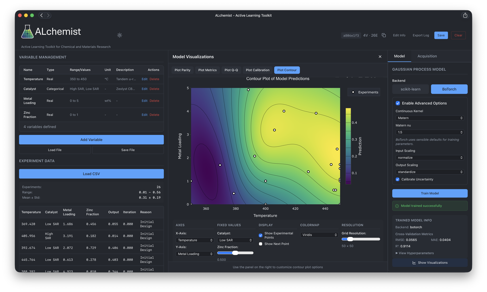

**ALchemist: Active Learning Toolkit for Chemical and Materials Research**

[](https://pypi.org/project/alchemist-nrel/)
[](https://github.com/NatLabRockies/ALchemist/actions/workflows/tests.yml)
[](https://www.python.org/downloads/)
[](LICENSE)

ALchemist is a modular Python toolkit that brings active learning and Bayesian optimization to experimental design in chemical and materials research. It is designed for scientists and engineers who want to efficiently explore or optimize high-dimensional variable spaces—using intuitive graphical interfaces, programmatic APIs, or autonomous optimization workflows.

**NLR Software Record:** SWR-25-102

---



## Documentation

Full user guide and documentation:  
[https://natlabrockies.github.io/ALchemist/](https://natlabrockies.github.io/ALchemist/)

---

## Overview

**Key Features:**

- **Flexible variable space definition**: Real, integer, categorical, and discrete variables with bounds or allowed value sets
- **Full DoE suite**: Space-filling (LHS, Sobol), classical RSM (CCD, Box-Behnken, Full/Fractional Factorial), screening (Plackett-Burman, GSD), and optimal designs (D/A/I-optimal with five exchange algorithms)
- **AI-assisted experimental design**: LLM-powered effect selection for optimal designs — integrates with OpenAI, local Ollama models, and Edison Scientific literature search
- **Probabilistic surrogate modeling**: Gaussian process regression via BoTorch (Matern, RBF, IBNN kernels) or scikit-learn backends
- **Advanced acquisition strategies**: Efficient sampling using qEI, qPI, qUCB, and qNegIntegratedPosteriorVariance
- **Multi-objective optimization**: Pareto frontier visualization and hypervolume convergence tracking
- **Modern web interface**: React-based UI with FastAPI backend for seamless active learning workflows
- **Desktop GUI**: CustomTkinter desktop application for offline optimization
- **Session management**: Save/load optimization sessions with audit logs for reproducibility
- **Multiple interfaces**: No-code GUI, Python Session API, or REST API for different use cases
- **Autonomous optimization**: Staged experiments API enables human-out-of-the-loop operation for reactor-in-the-loop and automated laboratory workflows
- **Experiment tracking**: CSV logging, reproducible random seeds, and comprehensive audit trails  

**Architecture:**

ALchemist is built on a clean, modular architecture:

- **Core Session API**: Headless Bayesian optimization engine (`alchemist_core`) that powers all interfaces
- **Desktop Application**: CustomTkinter GUI using the Core Session API, designed for human-in-the-loop and offline optimization
- **REST API**: FastAPI server providing a thin wrapper around the Core Session API for remote access; includes a staged experiments queue for autonomous reactor-in-the-loop workflows
- **Web Application**: React UI consuming the REST API, supporting both interactive and autonomous optimization workflows; real-time WebSocket event streaming for live session monitoring

Session files (JSON format) are fully interoperable between desktop and web applications, enabling seamless workflow transitions.

---

## Use Cases

- **Interactive Optimization**: Use desktop or web GUI for manual experiment design and human-in-the-loop optimization
- **Programmatic Workflows**: Import the Session API in Python scripts or Jupyter notebooks for batch processing
- **Autonomous Optimization**: Use the REST API to integrate ALchemist with automated laboratory equipment for real-time process control
- **Remote Monitoring**: Web dashboard provides read-only monitoring mode when ALchemist is being remote-controlled

For detailed application examples, see [Use Cases](https://natlabrockies.github.io/ALchemist/use_cases/) in the documentation.

---

## Installation

**Requirements:** Python 3.11 or higher

**Recommended (Optional):** We recommend using [Anaconda](https://www.anaconda.com/products/distribution) to manage Python environments:

```bash
conda create -n alchemist-env python=3.13
conda activate alchemist-env
```

**Basic Installation:**

```bash
pip install alchemist-nrel
```

**From GitHub:**
> *Note: This installs the latest unreleased version. The web application is not pre-built with this method because static build files are not included in the repository.*

```bash
pip install git+https://github.com/NatLabRockies/ALchemist.git
```

For advanced installation options, Docker deployment, and development setup, see the [Advanced Installation Guide](https://natlabrockies.github.io/ALchemist/#advanced-installation) in the documentation.

---

## Running ALchemist

**Web Application:**
```bash
alchemist-web
```
Opens at [http://localhost:8000/app](http://localhost:8000/app)

**Desktop Application:**
```bash
alchemist
```

For detailed usage instructions, see [Getting Started](https://natlabrockies.github.io/ALchemist/) in the documentation.

---

## Development Status

ALchemist is under active development at NLR as part of the DataHub project within the ChemCatBio consortium.

---

## Issues & Troubleshooting

If you encounter any issues or have questions, please [open an issue on GitHub](https://github.com/NatLabRockies/ALchemist/issues) or contact ccoatney@nlr.gov.

For the latest known issues and troubleshooting tips, see the [Issues & Troubleshooting Log](docs/ISSUES_LOG.md).

We appreciate your feedback and bug reports to help improve ALchemist!

---

## License

This project is licensed under the BSD 3-Clause License. See the [LICENSE](LICENSE) file for details.

---

## Repository

[https://github.com/NatLabRockies/ALchemist](https://github.com/NatLabRockies/ALchemist)

